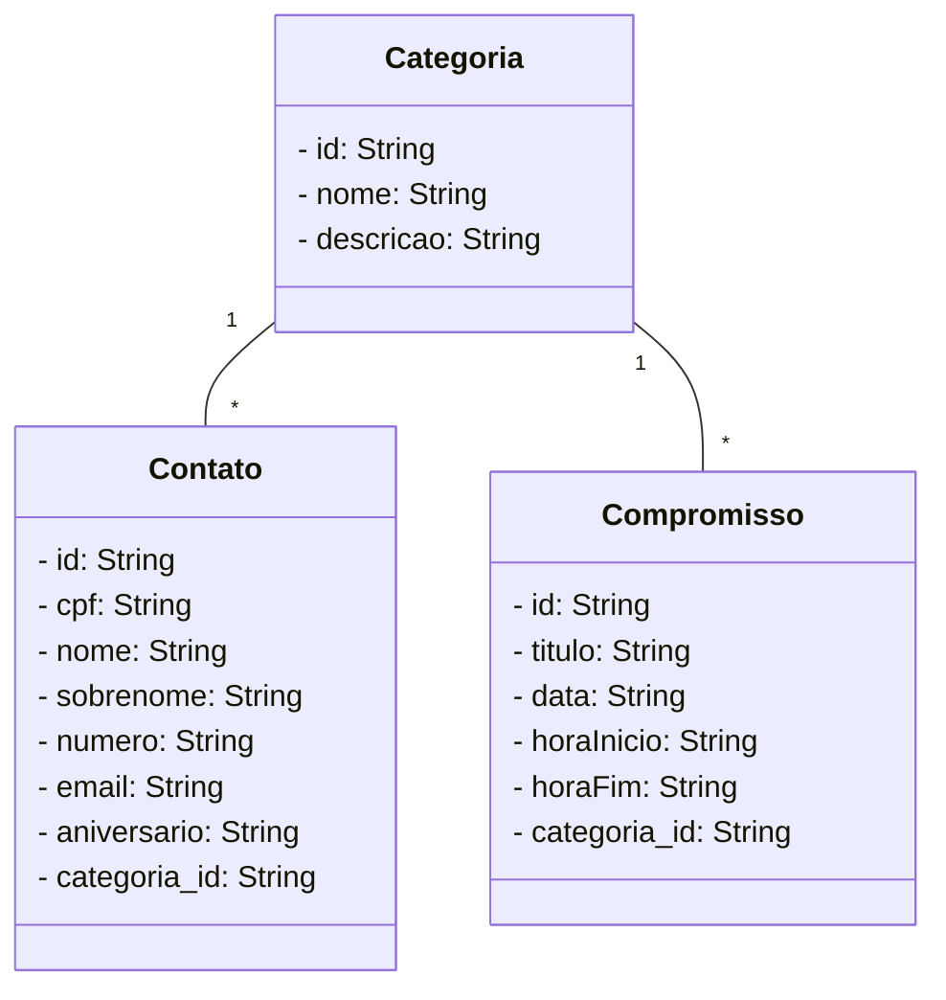

```mermaid
classDiagram
    Categoria "1" -- "*" Contato
    Categoria "1" -- "*" Compromisso

class Contato {
    - id: String
    - cpf: String
    - nome: String
    - sobrenome: String
    - numero: String
    - email: String
    - aniversario: String
    - categoria_id: String
}

class Categoria {
    - id: String
    - nome: String
    - descricao: String
}

class Compromisso {
    - id: String
    - titulo: String
    - data: String
    - horaInicio: String
    - horaFim: String
    - categoria_id: String
}
```
